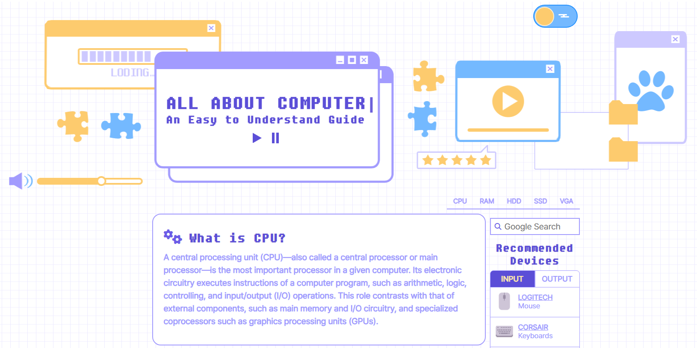

# All about Computer

### 🔗링크
https://asdf080.github.io/All-about-Computer/

### 🔎소개
첫 개인 작품으로, 기초적인 문법을 이용해 만든 웹페이지입니다.
컴퓨터의 주요 부품에 대한 설명이 담겨있습니다.

### 📅제작 기간
2023.12.06 ~ 2023.12.08

### 🗂개발 환경
- HTML
- CSS
- JavaScript

### 🎈주요 기능
- 다크 모드/라이트 모드 토글 버튼
- JS 함수를 이용한 자동 타이핑 타이틀과 타이핑 일시정지/재생 버튼

### ✔ 미리보기

